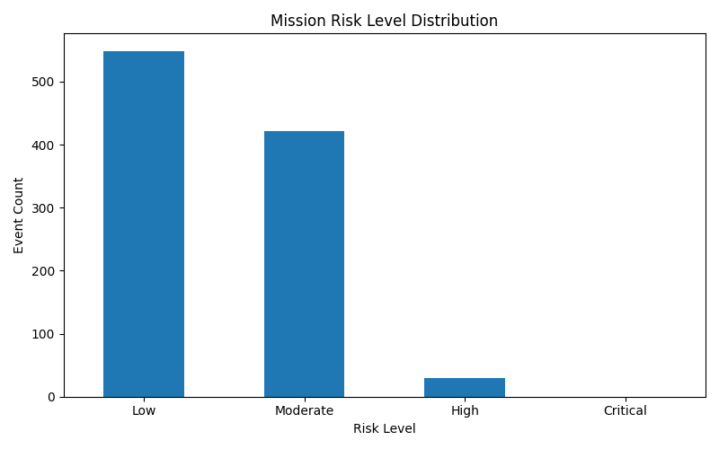
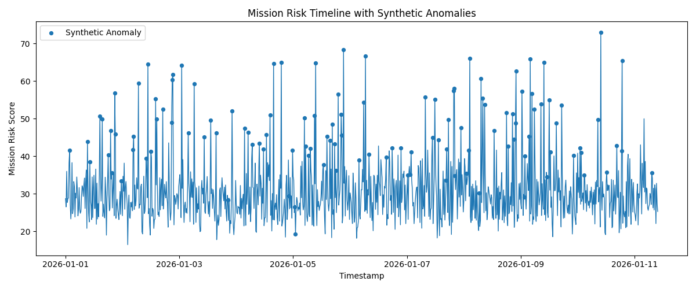
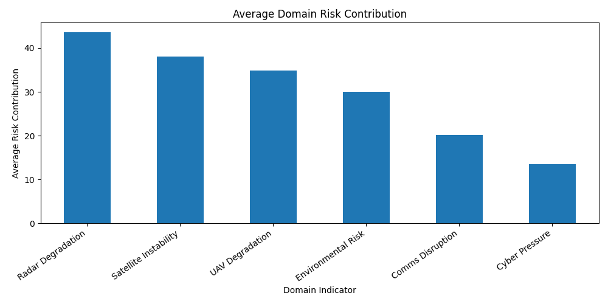
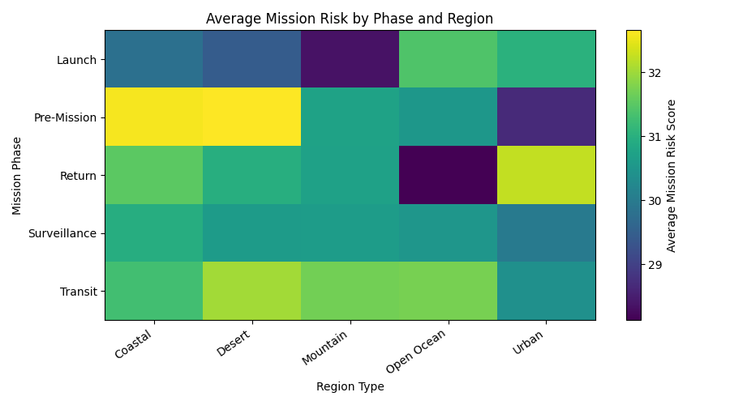

# Multi-Domain Threat Fusion Agent

A Python and Streamlit dashboard that simulates multi-domain mission event data, detects anomalous system behavior using machine learning, scores mission risk, and generates analyst-style mission briefings through a local or optional LLM-powered AI briefing workflow.

This project demonstrates applied skills in defense-style analytics, anomaly detection, machine learning, AI-assisted decision support, data visualization, synthetic data generation, and operational risk reporting.

> **Safety Note:** This project uses fully synthetic data for educational purposes. It does not use real defense, military, aerospace, satellite, cyber, intelligence, or operational mission data.

---

## Project Overview

Modern defense and aerospace systems often depend on information from multiple operational domains, including radar, satellite telemetry, cyber activity, communications, unmanned aerial systems, and environmental conditions. In real mission environments, these signals may be noisy, incomplete, or difficult to interpret in isolation.

This project simulates a multi-domain mission analysis workflow. It generates synthetic mission-event data, injects realistic anomaly patterns, engineers domain-specific risk indicators, trains machine learning models to detect abnormal behavior, assigns mission risk levels, and presents the results in an interactive Streamlit dashboard.

It also includes an AI-assisted mission briefing layer that converts technical model outputs into a readable analyst-style report. The briefing workflow can run locally without an API key or use the OpenAI API when an `OPENAI_API_KEY` is available.

---

## Why This Project Matters

Multi-domain systems are complex because risk may not come from one signal alone. A radar reading may look unusual, but it becomes more important if it occurs at the same time as communications degradation, satellite telemetry instability, cyber alert spikes, or severe environmental conditions.

Machine learning can help identify unusual patterns across large datasets, while engineered risk features can make those patterns easier to interpret. An AI-assisted briefing layer can then summarize the results for review.

This project demonstrates how AI and analytics can support:

- Multi-domain mission awareness
- Sensor and telemetry risk analysis
- Anomaly detection
- Cyber and communications risk monitoring
- Mission risk prioritization
- Analyst-support reporting
- Analyst-support decision workflows

---

## Key Features

- Generates synthetic multi-domain mission event data
- Simulates radar, satellite, UAV, cyber, communications, and environmental signals
- Injects realistic anomaly patterns into the dataset
- Cleans and preprocesses mission-event records
- Engineers domain-level health and risk indicators
- Calculates mission risk scores from multiple signal categories
- Assigns readable mission risk levels
- Trains an Isolation Forest anomaly detection model
- Trains a Random Forest anomaly classification model
- Produces model performance summaries and feature importance outputs
- Generates static PNG visualizations
- Provides an interactive Streamlit dashboard
- Includes a local AI mission briefing fallback that does not require an API key
- Supports an optional LLM-powered briefing workflow using the OpenAI API
- Includes a dashboard toggle to enable or disable the OpenAI-powered briefing
- Saves mission assessment reports, model summaries, risk distributions, and visual outputs

---

## Dataset

This project uses a synthetic multi-domain mission event dataset generated by the project itself. The dataset is not real military, aerospace, cyber, satellite, or defense data. It does not contain sensitive, classified, proprietary, export-controlled, or operational information.

The generated dataset includes the following fields:

- Event ID
- Timestamp
- Mission phase
- Region type
- Radar signal strength
- Radar noise level
- Satellite temperature
- Satellite power level
- UAV battery level
- UAV altitude
- Communication latency
- Communication packet loss
- Cyber alert count
- Failed login attempts
- Weather severity
- Injected anomaly label
- Injected anomaly type

The project injects simulated anomaly types such as:

- Radar Degradation
- Satellite Telemetry Spike
- Cyber Intrusion Pattern
- Communication Disruption
- Multi-Domain Escalation

These simulated anomalies allow the project to demonstrate an end-to-end machine learning and mission-risk workflow in a safe, reproducible way.

---

## Why Synthetic Data?

This project uses synthetic data because real integrated multi-domain defense datasets are not publicly available and should not be used for public portfolio projects.

Public datasets may exist for isolated areas such as satellite telemetry, cyber alerts, or weather conditions, but they generally do not combine radar, satellite, UAV, communications, cyber, and environmental signals into one mission-style event dataset.

Synthetic data allows this project to safely demonstrate:

- Multi-domain data fusion concepts
- AI-assisted mission risk analysis
- Machine learning anomaly detection
- Analyst-support workflows
- Reproducible project execution
- Public GitHub-safe development

The synthetic dataset is intentionally designed to resemble the structure of a complex operational monitoring system without using real operational data.

---

## Machine Learning Approach

This project uses both unsupervised and supervised machine learning.

### Isolation Forest

The Isolation Forest model is used for unsupervised anomaly detection. It identifies records that behave differently from the rest of the dataset based on the engineered mission-event features.

In this project, Isolation Forest helps flag events that may represent unusual multi-domain behavior.

### Random Forest Classifier

The Random Forest classifier is used as a supervised anomaly classification model. It learns from the synthetic anomaly labels created during data generation and predicts whether a mission event is normal or anomalous.

The model also produces feature importance values, helping identify which signals contributed most strongly to anomaly classification.

The model uses features such as:

- Radar health score
- Satellite stability score
- UAV operational score
- Communication reliability score
- Cyber pressure index
- Environmental risk index
- Sensor degradation index
- Multi-domain pressure score
- Simultaneous domain stress count
- Mission phase
- Region type
- Raw synthetic signal values

---

## Feature Engineering

This project creates domain-specific features that make the dataset more useful for risk scoring and machine learning.

Engineered features include:

- Radar health score
- Satellite stability score
- UAV operational score
- Communication reliability score
- Cyber pressure index
- Environmental risk index
- Sensor degradation index
- Multi-domain pressure score
- Simultaneous domain stress count

These features help transform raw synthetic readings into higher-level mission indicators. For example, communications risk is not based only on latency or packet loss alone. It is converted into a communication reliability score that can be compared with other domain-level indicators.

---

## Risk Scoring Logic

Each mission event is assigned a mission risk score from 0 to 100.

The score combines multiple domain indicators, including:

- Radar degradation
- Satellite telemetry instability
- UAV operational health
- Communications reliability
- Cyber pressure
- Environmental severity
- Sensor degradation
- Multi-domain pressure
- Simultaneous domain stress

Risk levels include:

- Low
- Moderate
- High
- Critical

The risk scoring system is designed to prioritize events that show stress across multiple domains rather than isolated signal noise.

---

## AI Mission Briefing Layer

This project includes an AI-assisted mission briefing workflow that converts machine learning outputs and risk scores into a readable analyst-style report.

The local briefing workflow does not require an API key. It uses built-in logic to identify the highest-risk events, summarize risk drivers, and recommend analyst review actions.

The optional LLM-powered briefing workflow uses the OpenAI API when an `OPENAI_API_KEY` environment variable is available. When enabled, the LLM receives summarized synthetic mission-risk context and generates a professional briefing that includes:

- Executive summary
- Highest-risk event overview
- Primary risk drivers
- Mission-risk interpretation
- Recommended analyst review actions
- Safety note explaining that the dataset is synthetic

If no API key is available, the project automatically falls back to the local briefing generator.

---

## API Key Setup

The OpenAI API key is optional.

The project works without an API key because it includes a local fallback briefing generator. However, to use the LLM-powered mission briefing mode, create a `.env` file in the main project folder.

Inside `.env`, add:

```env
OPENAI_API_KEY=sk-your_api_key_here
```

To test the OpenAI-powered briefing, run:

```powershell
python src/main.py
```

To test it from the dashboard, run:

```powershell
python -m streamlit run app/streamlit_app.py
```

Then use the sidebar checkbox labeled:

```text
Use OpenAI briefing if API key is available
```

When checked, the dashboard will attempt to use the OpenAI-powered briefing workflow. 

---

## How to Run the Project

### 1. Install dependencies

```powershell
pip install -r requirements.txt
```

If needed, use:

```powershell
python -m pip install -r requirements.txt
```

### 2. Generate the synthetic dataset

```powershell
python src/data_generator.py
```

This creates:

```text
data/synthetic_multi_domain_events.csv
```

### 3. Run the full pipeline

```powershell
python src/main.py
```

This generates the processed mission-risk outputs, machine learning results, AI briefing, and visualizations.

### 4. Launch the Streamlit dashboard

```powershell
python -m streamlit run app/streamlit_app.py
```

---

## Testing

This project includes unit tests for the data generation, mission risk scoring, and AI briefing workflows. The tests verify that the synthetic dataset is generated correctly, risk scores stay within the expected range, risk levels are assigned properly, and the local AI briefing workflow produces readable output without requiring an API key.

To run the test suite:

```powershell 
python -m pytest
```
---

## Streamlit Dashboard

The dashboard includes five main sections.

### Mission Assessment

This section displays the filtered mission-risk assessment dataset. Users can review event IDs, timestamps, mission phases, region types, anomaly types, risk scores, risk levels, and model outputs.

### High-Risk Events

This section highlights the highest-risk events based on mission risk score. It helps prioritize analyst review by showing the most important mission-event records first.

### AI Briefing

This section displays the generated AI-assisted mission briefing. Depending on the dashboard setting and API key availability, this briefing may be generated by the local fallback workflow or the optional OpenAI-powered workflow.

### Model Summary

This section displays machine learning model results, including accuracy, training rows, testing rows, confusion matrix, classification report, and top feature drivers.

### Visualizations

This section displays generated PNG charts that summarize mission risk levels, anomaly timelines, domain risk contributions, and average mission risk by phase and region.

---

## Visualizations

Running `python src/main.py` creates four saved PNG images in the `outputs/figures/` folder. These images summarize mission risk levels, anomaly behavior over time, domain-level risk contribution, and average mission risk by mission phase and region type. The Streamlit dashboard provides an interactive version of this analysis.

---

### Risk Level Distribution



This saved image shows how many synthetic mission events fall into each mission risk category: Low, Moderate, High, and Critical.

Risk levels are assigned using the project’s mission risk scoring logic, which combines radar health, satellite stability, UAV operational status, communications reliability, cyber pressure, environmental severity, sensor degradation, and multi-domain pressure.

This view is useful because it gives a quick summary of the overall mission-risk profile. If many events fall into the High or Critical categories, the simulated mission environment may require closer analyst review or escalation.

---

### Anomaly Timeline



This saved image shows mission risk scores over time and highlights synthetic anomaly events.

The timeline helps show whether high-risk or anomalous activity is isolated or clustered during specific periods. A cluster of anomalous events may suggest a simulated period of elevated mission stress, such as radar degradation, satellite telemetry instability, cyber pressure, communications disruption, or multi-domain escalation.

This view is useful because timing matters in mission analysis. A single unusual event may be important, but multiple unusual events occurring close together can indicate a larger operational pattern.

---

### Domain Risk Contribution



This saved image compares the average risk contribution from each simulated operational domain.

The domains include radar, satellite, UAV, communications, cyber, and environmental indicators. Each domain contributes to the overall mission risk score based on its simulated health, reliability, pressure, or severity.

This view helps explain which domains are contributing most strongly to mission risk. For example, higher cyber contribution may suggest elevated cyber pressure, while higher communications contribution may point to latency, packet loss, or degraded communication reliability.

---

### Mission Risk Heatmap



This saved image shows average mission risk by mission phase and region type.

Instead of looking at individual mission events one by one, this view summarizes how risk changes across different operational contexts. Certain mission phases or region types may show higher average risk due to environmental severity, communications reliability issues, sensor degradation, cyber pressure, or multi-domain stress.

This view is useful for identifying where mission risk tends to concentrate across the simulated dataset. It helps connect individual event-level risk scoring to a broader mission-planning or analyst-review perspective.

---

## File Breakdown

### `app/streamlit_app.py`

This file runs the interactive Streamlit dashboard. It loads the final mission-risk assessment dataset, displays high-level metrics, provides dashboard filters, shows the highest-risk events, displays the AI-generated mission briefing, shows the machine learning model summary, and presents generated PNG visualizations. It also includes the sidebar toggle that allows the user to enable or disable the optional OpenAI-powered briefing workflow.

### `src/data_generator.py`

This file generates the synthetic multi-domain mission event dataset. It creates simulated records across radar, satellite telemetry, UAV status, communications, cyber activity, and environmental conditions. It also injects simulated anomaly patterns such as radar degradation, satellite telemetry spikes, cyber intrusion patterns, communications disruption, and multi-domain escalation events.

### `src/preprocessing.py`

This file loads and prepares the synthetic mission-event dataset. It converts timestamps, handles missing values, adds time-based features, and prepares encoded features for machine learning workflows.

### `src/feature_engineering.py`

This file creates higher-level mission-risk features from the cleaned dataset. These features include radar health score, satellite stability score, UAV operational score, communication reliability score, cyber pressure index, environmental risk index, sensor degradation index, multi-domain pressure score, and simultaneous domain stress count.

### `src/risk_scoring.py`

This file calculates the mission risk score and assigns readable risk levels. It combines engineered domain indicators into a 0-to-100 risk score and classifies each event as Low, Moderate, High, or Critical risk. It also creates a risk distribution summary.

### `src/anomaly_detection.py`

This file contains the machine learning anomaly detection workflow. It trains an Isolation Forest model for unsupervised anomaly detection and a Random Forest classifier for supervised anomaly classification. It also adds model predictions, anomaly probabilities, and feature importance results to the final mission-risk workflow.

### `src/agent_briefing.py`

This file generates the AI-assisted mission briefing. It includes a local fallback briefing generator that works without an API key and an optional OpenAI-powered briefing generator that uses the OpenAI API when an `OPENAI_API_KEY` is available. The briefing summarizes the highest-risk events, identifies likely domain-level risk drivers, and recommends analyst review actions.

### `src/visualization.py`

This file creates static PNG visualizations from the final mission-risk assessment dataset. It generates charts for risk level distribution, anomaly timeline, average domain risk contribution, and mission risk heatmap. These figures are saved in the `outputs/figures/` folder and can be displayed in the README.

### `src/main.py`

This file runs the full project pipeline from one command. It generates the synthetic dataset, cleans and preprocesses records, creates engineered features, scores mission risk, trains machine learning models, saves the final assessment dataset, saves the model summary, generates visualizations, and creates the AI-assisted mission briefing.

### `tests/test_data_generator.py`

This file contains unit tests for the synthetic data generation workflow. It verifies that the generated dataset has the expected structure, row count, and anomaly label behavior.

### `tests/test_risk_scoring.py`

This file contains unit tests for the mission risk scoring logic. It verifies that risk scores and risk levels are generated correctly from engineered mission-risk features.

### `tests/test_agent_briefing.py`

This file contains unit tests for the AI briefing workflow. It verifies that the local briefing generator produces readable mission briefing text without requiring an API key.

### `requirements.txt`

This file lists the Python libraries required to run the project. It includes dependencies for data processing, machine learning, visualization, dashboarding, environment variable management, OpenAI API integration, and testing.

### `data/synthetic_multi_domain_events.csv`

This is the synthetic mission-event dataset generated by `src/data_generator.py` or `src/main.py`. It contains simulated multi-domain mission records and injected anomaly labels. This file can be regenerated at any time.

### `outputs/reports/mission_risk_assessment.csv`

This file contains the final processed and scored mission-risk dataset. It includes the original synthetic signals, engineered risk features, mission risk scores, risk levels, machine learning anomaly predictions, and anomaly probabilities.

### `outputs/reports/risk_distribution.csv`

This file contains a summary of how many mission events fall into each risk level category, along with percentage values.

### `outputs/reports/model_summary.txt`

This file contains the machine learning model summary, including model accuracy, training rows, testing rows, confusion matrix, classification report, and top feature drivers.

### `outputs/reports/ai_mission_briefing.txt`

This file contains the generated AI-assisted mission briefing. Depending on API key availability and dashboard settings, the briefing may be generated by the local fallback workflow or the optional OpenAI-powered workflow.

### `outputs/figures/risk_level_distribution.png`

This image shows the distribution of mission risk levels across the synthetic mission-event dataset.

### `outputs/figures/anomaly_timeline.png`

This image shows mission risk scores over time and highlights synthetic anomaly events.

### `outputs/figures/domain_risk_contribution.png`

This image shows average domain-level risk contribution across radar, satellite, UAV, communications, cyber, and environmental indicators.

### `outputs/figures/mission_risk_heatmap.png`

This image shows average mission risk by mission phase and region type.

---

## Tech Stack

- Python
- Pandas
- NumPy
- Scikit-learn
- Isolation Forest
- Random Forest Classifier
- Matplotlib
- Streamlit
- OpenAI API
- Python-dotenv
- Pytest
- PowerShell
- Visual Studio Code

---

## Project Architecture

```text
Multi Domain Threat Fusion Agent/
│
├── data/
│   └── synthetic_multi_domain_events.csv          # Included synthetic dataset; can be regenerated
│
├── outputs/
│   ├── reports/
│   │   ├── mission_risk_assessment.csv            # Included sample output; can be regenerated
│   │   ├── risk_distribution.csv                  # Included sample output; can be regenerated
│   │   ├── model_summary.txt                      # Included sample output; can be regenerated
│   │   └── ai_mission_briefing.txt                # Included sample output; can be regenerated
│   │
│   └── figures/
│       ├── risk_level_distribution.png            # Included generated chart; can be regenerated
│       ├── anomaly_timeline.png                   # Included generated chart; can be regenerated
│       ├── domain_risk_contribution.png           # Included generated chart; can be regenerated
│       └── mission_risk_heatmap.png               # Included generated chart; can be regenerated
│
├── app/
│   └── streamlit_app.py
│
├── src/
│   ├── data_generator.py
│   ├── preprocessing.py
│   ├── feature_engineering.py
│   ├── risk_scoring.py
│   ├── anomaly_detection.py
│   ├── agent_briefing.py
│   ├── visualization.py
│   └── main.py
│
├── tests/
│   ├── test_data_generator.py
│   ├── test_risk_scoring.py
│   └── test_agent_briefing.py
├── README.md
└── requirements.txt
```

---

## Future Improvements

Potential future improvements include:

- Add more advanced time-series anomaly detection models
- Add model explainability with SHAP or permutation importance
- Add interactive Plotly charts
- Add downloadable reports from the Streamlit dashboard
- Add support for multiple synthetic mission scenarios
- Add configurable anomaly injection settings
- Add automated model comparison
- Add Docker support for easier deployment
- Expand the unit test suite
- Add a scenario configuration file for adjusting mission phases, anomaly rates, and domain signal behavior
- Add a dashboard page for comparing local briefing output against LLM-generated briefing output

---

## Disclaimer

This project is for educational and demonstration purposes only.

All data used in this project is synthetic. The system does not use real defense, military, aerospace, satellite, cyber, intelligence, or operational mission data.

This project is not intended for real-world defense, aerospace, cyber, military, intelligence, targeting, weapons, or operational decision-making use.

The AI-assisted briefing workflow is designed only to support analyst review and is not intended to make or automate operational decisions. It does not provide targeting recommendations, weapons guidance, autonomous operational decisions, or real mission instructions.

---
